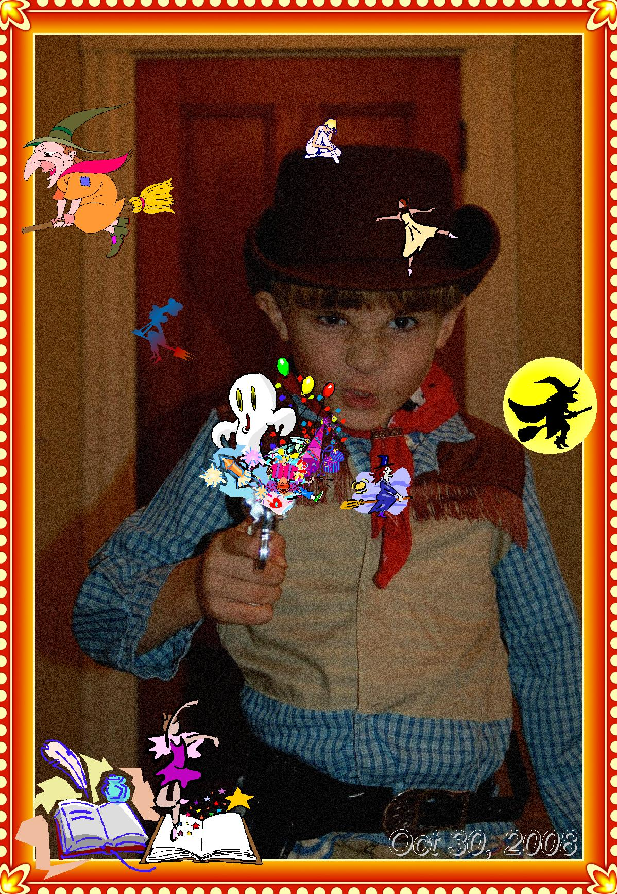

# stegify experiment

hiding childhood memories in childhood memories.

## digital memory


While going through my mom's photo library, we found a series of pictures I made with my toy camera when I was little.

After some digging, I found the software I was using in the photo: Kids Cam Sticker Factory. It was a piece of software that came bundled with a toy camera marketed to kids in the early 2000s. Surprisingly, I managed to find a copy on the [Internet Archive](https://archive.org/details/sticker-factory). It's Windows-only, but it ran mostly fine on my mac using WINE.

## pictures

I added clipart to some of the other childhood photos my mom had sent me. KCSF's clipart feature splits images up into categories with significant overlap (should a picture of a family watching TV be put in 'Together' or 'People' or 'Entertainment'?), so I had to search through every sticker to find one I wanted. Doing this a couple hundred times lulled me into a kind of nostalgic meditative state.

|  |  |  |
| --------------------------------------------------------------------------------------------------------------- | ----------------------------------------------------------------------------------------------------------------------------------------------------------------------------------------------------- | ----------------------------------------------------------------------------------------------------------------------------------------------------------------------------------------------------------------- |

## memories in memories

I made a little soundscape from [Celeste](https://www.celestegame.com/) samples and a [video](https://www.youtube.com/watch?v=y59hM2c7s4I) I made when I was 10 and hid it
in the photos using [steganography](https://en.wikipedia.org/wiki/steganography).

|                                                                                                     Original                                                                                                      |                                                                                                       Stegified                                                                                                        |
| :---------------------------------------------------------------------------------------------------------------------------------------------------------------------------------------------------------------: | :--------------------------------------------------------------------------------------------------------------------------------------------------------------------------------------------------------------------: |
|  |  |
|              |  |

To listen to the soundscape, use [`stegify`](https://github.com/DimitarPetrov/stegify) to decode the images:

```bash
stegify decode --carriers 'everythinghidden.jpeg gunslingerhidden.jpeg' --result 'childhood.mp3'
open childhood.mp3
```

If `stegify` isn't available on your system, the audio is up on my [website](https://klinegareth.com/childhood.mp3).
