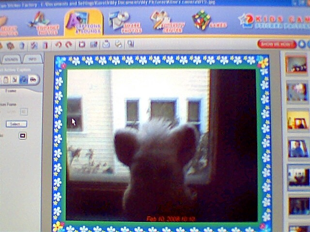
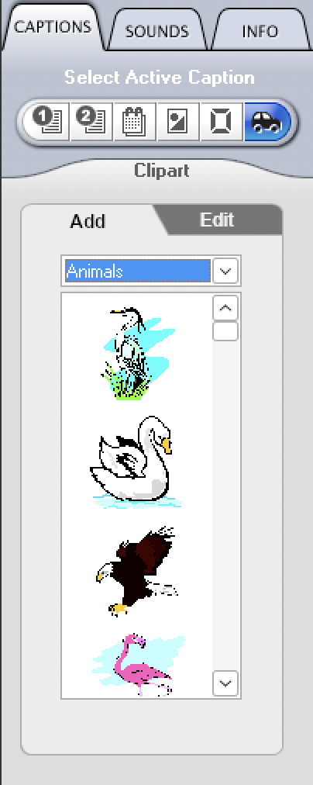

# stegify experiment

hiding childhood memories in childhood memories.

## digital investigation



While going through my mom's photo library, we found a series of pictures I made with my toy camera when I was little.

After some digging, I found the software I was using in the photo: Kids Cam Sticker Factory. It was a piece of software that came bundled with a toy camera marketed to kids in the early 2000s. Surprisingly, I managed to find a copy on the [Internet Archive](https://archive.org/details/sticker-factory). It's Windows-only, but it ran mostly fine on my mac using WINE.

## pictures



I added clipart to some of the other childhood photos my mom had sent me. KCSF's clipart feature splits images up into categories with significant overlap (should a picture of a family watching TV be put in 'Together' or 'People' or 'Entertainment'?), so quickly finding stickers I wanted to use wasn't really possible. The process felt meditative.

## sounds

i made a little soundscape from [Celeste](https://www.celestegame.com/) samples and a [video](https://www.youtube.com/watch?v=y59hM2c7s4I) I made when I was 10.

## encode/decode

<sub>(the fun part!)</sub>

I hid the soundscape in the pictures I made using [steganography](https://en.wikipedia.org/wiki/steganography).

Requires [`stegify`](https://github.com/DimitarPetrov/stegify)

```bash
git clone https://github.com/klinegareth/childhoodstegify
cd childhoodstegify

stegify decode --carriers 'everythinghidden.jpeg gunslinger.jpeg' --result 'result.mp3'
```
